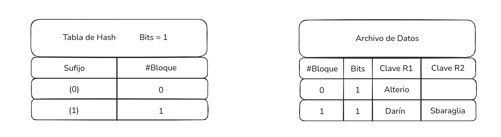
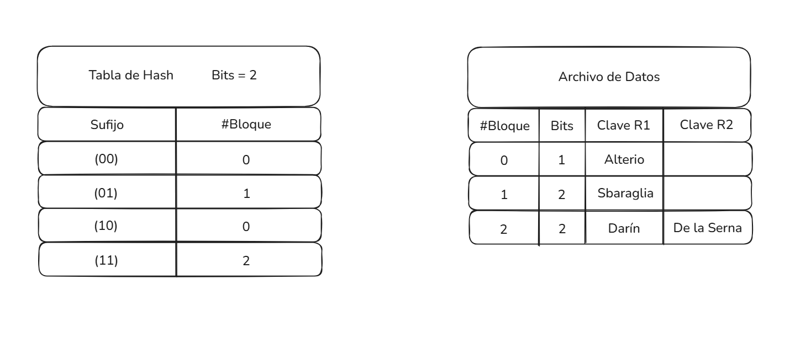
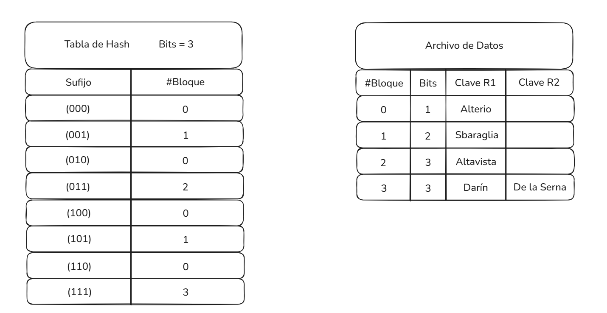
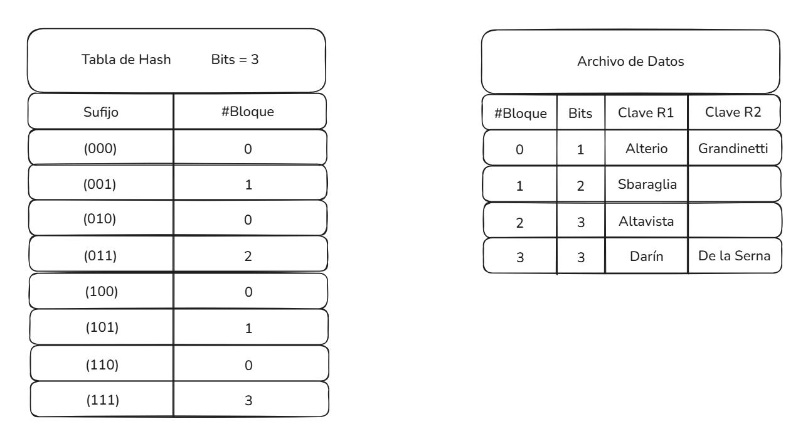
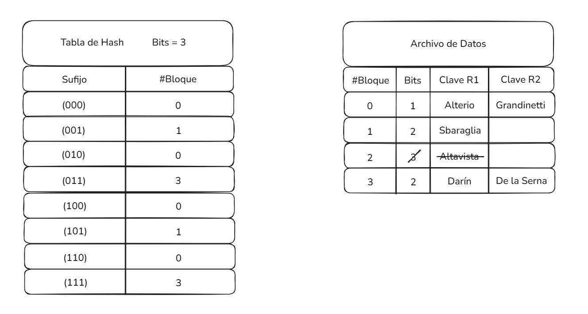
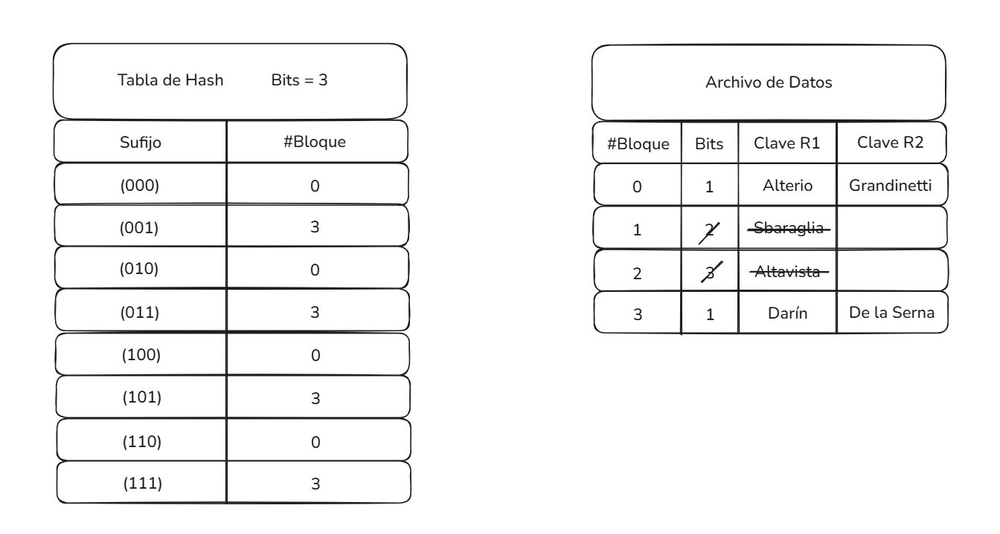

# Solution – Extensible Hashing (Capacity 2)

## Initial Conditions

- Hashing method: Extensible Hashing
- Bucket capacity: 2 records
- Addressing: Least significant bits
- Initial global depth: 0
- One empty bucket

---

## Operation 1: + Darín

The only existing bucket is empty.

The key is inserted without considering directory bits since the global depth is 0.

**Result:**  
Bucket 0 → Darín

---

## Operation 2: + Alterio

The key maps to the same bucket as Darín.

A collision occurs but no overflow is generated because the bucket still has available space.

**Result:**  
Bucket 0 → Darín, Alterio

---

## Operation 3: + Sbaraglia

The key maps to the same bucket.

Collision with overflow occurs because the bucket is full.

Resolution:

- Increase local depth of bucket 0 from 0 to 1.
- Create a new bucket with local depth 1.
- Since local depth (1) > global depth (0), increase global depth to 1 and duplicate the directory.
- Redistribute records according to the least significant bit.

**Result:**  
Directory size doubled.  
Records redistributed between bucket 0 and bucket 1.

---

## Operation 4: + De la Serna

Using 1 bit, the key maps to bucket 1.

Collision with overflow occurs.

Resolution:

- Increase local depth of bucket 1 from 1 to 2.
- Create new bucket.
- Since local depth (2) > global depth (1), increase global depth to 2 and duplicate the directory.
- Redistribute records using 2 least significant bits.

---

## Operation 5: + Altavista

Using 2 bits, the key maps to bucket 2.

Overflow occurs.

Resolution:

- Increase local depth of bucket 2 from 2 to 3.
- Create new bucket.
- Since local depth (3) > global depth (2), increase global depth to 3 and duplicate directory.
- Redistribute using 3 least significant bits.

---

## Operation 6: + Grandinetti

Using 3 bits, the key maps to bucket 0.

Collision occurs but no overflow.

The key is inserted successfully.

---

## Operation 7: - Altavista

The key maps to bucket 2.

The record is deleted.

The bucket becomes empty.

Since its local depth equals the global depth (3), we check its buddy bucket.

The buddy bucket has the same local depth and valid records, so:

- Bucket 2 is removed.
- Buddy bucket absorbs its range.
- Local depth is reduced.
- Directory is updated.

---

## Operation 8: - Sbaraglia

The key maps to bucket 1.

After deletion, the bucket becomes empty.

Since its local depth is smaller than global depth and buddy conditions are satisfied:

- Bucket 1 is removed.
- References are redirected.
- Local depth is reduced.

Final directory and data file state:

---

## Final Structure

- Global depth: 3
- Remaining buckets correctly referenced
- Directory updated after merges

This exercise demonstrates dynamic growth and shrinkage of extensible hashing.
