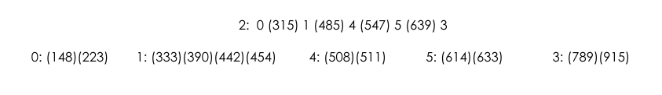
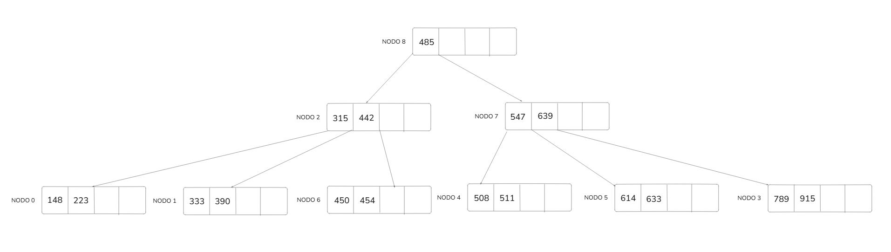
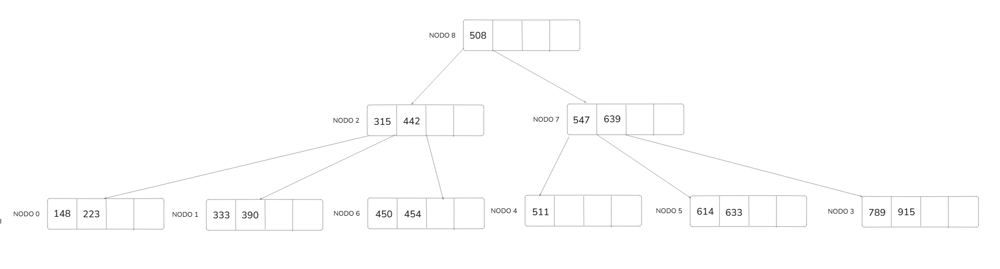
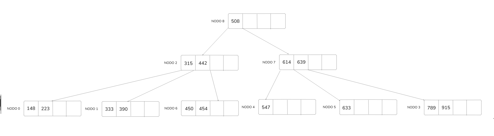
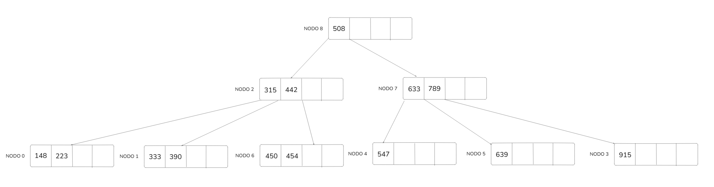

# Solution – B-Tree Order 5 (Right Policy)

---

## Initial State

---

## Operation 1: +450

### Search Phase

- Read root (2).
- 315 < 450 < 485 → descend to node 1.
- Read node 1.

Reads: 2

### Insertion and Overflow

Node 1 contains:
333, 390, 442, 454

After insertion:
333, 390, 442, 450, 454 → overflow (5 keys)

Split:

- Node 1: 333, 390  
- Node 6: 450, 454  
- Promote 442  

Writes:
- Node 1  
- Node 6  

### Propagation to Parent

Parent (node 2) already has maximum keys:
315, 485, 547, 639

Insert 442 → overflow:
315, 442, 485, 547, 639

Split:

- Node 2: 315, 442  
- Node 7: 547, 639  
- Promote 485  

Create new root (node 8).

Writes:
- Node 2  
- Node 7  
- Node 8  

### Resulting Tree

### I/O Summary

Reads: 2  
Writes: 5  

---

## Operation 2: -485

### Search Phase

- Read root (8).
- Key found in internal node.

Reads: 1

### Replacement

Replace with smallest key from right subtree.

- Read node 7.
- Read node 4 (leftmost leaf of right subtree).

Successor: 508

Rewrite:
- Node 8 (replace 485 with 508)  
- Node 4 (remove 508)  

No underflow occurs.

### Resulting Tree

### I/O Summary

Reads: 3  
Writes: 2  

---

## Operation 3: -511

### Search Phase

- Read root (8).
- Descend right.
- Read node 7.
- Descend left.
- Read node 4.

Reads: 3

Remove 511 → underflow.

### Underflow Resolution (Right Policy)

Right sibling (node 5) has extra keys.

Redistribution:

- Node 4 receives 547  
- Parent separator updated  
- Node 5 updated accordingly  

Writes:
- Node 4  
- Node 5  
- Node 7  

### Resulting Tree

### I/O Summary

Reads: 4  
Writes: 3  

---

## Operation 4: -614

### Search Phase

- Read root (8).
- Descend right.
- Read node 7.

Key found in internal node.

Reads: 2

### Replacement

Replace with successor.

- Read node 5.
- Read node 3.

Successor: 633

Remove 633 → underflow.

Right sibling allows redistribution.

Redistribution:

- Node 5 receives 639  
- Parent updated  
- Node 3 updated  

Writes:
- Node 5  
- Node 3  
- Node 7  

### Resulting Tree

### I/O Summary

Reads: 4  
Writes: 3  
